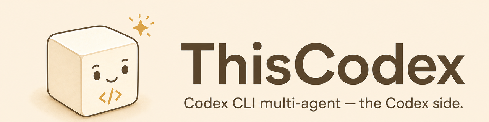
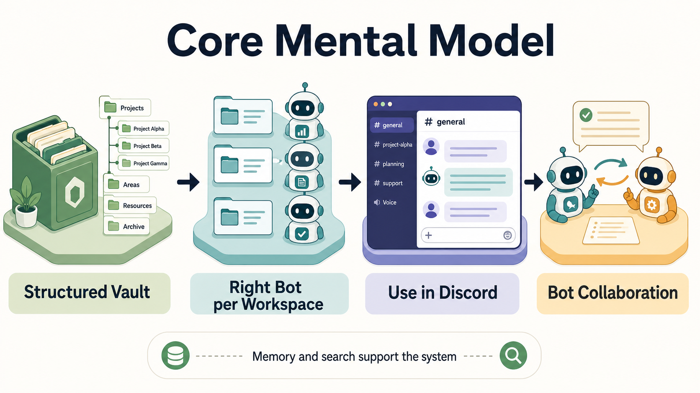

# ThisCodex

> A reproducible setup for running **Claude Code + Codex CLI multi-agent bots** over **Discord**, wired into an **Obsidian vault** with shared folder/memory rules.
>
> 🇰🇷 [한국어 README](./README.ko.md) · 📦 Companion runtime: [ThisCode](https://github.com/treylom/ThisCode) (Claude Code side) · 📖 [Getting started guide (English PDF, beginner, 14p)](docs/getting-started/ThisCode-ThisCodex-getting-started.en.pdf) · This repo = the **Codex side** + cross-runtime conventions.



> **New here?** This one picture is the whole idea: a **structured Obsidian vault**, the **right bot in each working directory** (Claude Code *and* Codex), all driven from **Discord**, with the bots collaborating. ThisCodex is the Codex side — install it as a skill (`skills/thiscodex/`) and follow §3.


>
> **Before you start (recommended):** lay out your Obsidian **folder structure** first and **install Obsidian** for full memory + internal-search. Without Obsidian you can still wire a plain Discord bot, but memory / internal-search quality is **not guaranteed**.

ThisCodex packages the hard-won, **verified** pattern for making a Codex CLI agent (`codex` by OpenAI) behave like the Claude Code Discord bots — same persona discipline, same Discord I/O, same vault rules — plus the multi-agent conventions (cross-bot addressing, meeting threads, SessionStart context injection) that let Claude Code and Codex agents collaborate in one Discord workspace.

It is **not** a framework. It is a documented set of building blocks you assemble yourself, with every claim traced to a source.

---

## Codex plugin packaging

This repository now carries a canonical Codex plugin package surface:
`.codex-plugin/plugin.json`, root `skills/SKILL.md`, plugin-level `agents/`,
`plugin.lock.json`, and `scripts/sync-to-codex-plugin.sh`. The layout follows
the current OpenAI plugin conventions seen in `openai/plugins` and the public
`obra/superpowers` sync pattern.

Plugin packaging makes ThisCodex discoverable as a Codex plugin. **Guided
onboarding is still separate.** After the plugin or skill is visible, run
`thiscodex init` to confirm the repo, workspace, BOT_WD, state directory, Codex
config, runner guidance, and final doctor checks before claiming the bot is
ready.

---

## 1. What you get

| Capability | Status | Mechanism |
|---|---|---|
| Codex CLI as a persistent Discord bot | ✅ working | `codex app-server` (headless) + Python bridge daemon (`bot.py`) + discord.py |
| Multi-client same-thread (watch/steer the bot's conversation from a TUI) | ✅ working | `codex resume <thread-id> --remote ws://…` against the same app-server |
| Persona / vault rules auto-loaded | ✅ working | `~/.codex/config.toml` → `project_doc_fallback_filenames = ["SOUL.md","AGENTS.md"]` |
| Cross-bot addressing + meeting discipline | ✅ working | `bot-roster.yaml` SoT injected at SessionStart |
| YOLO (full-access) execution | ✅ working | `thread/start` **and** `thread/resume` both send `sandbox:"danger-full-access"`, `approvalPolicy:"never"` |
| Image generation | ✅ working | codex built-in `image_gen.imagegen` tool |
| Web fetch/search | ✅ working | codex built-in `web.run` tool |
| `computer_use` / `browser_use` (desktop/browser control) | ⏸️ **parked** | `codex features list` shows `stable,true`, **but no official `codex` command/subcommand exposes it**, so it is **not a callable tool** on the CLI/app-server surface (ships only as a Desktop-app-bundled MCP). Tracked upstream: [openai/codex#20851](https://github.com/openai/codex/issues/20851). Documented, not hacked. |

Everything marked ✅ is empirically verified (see §6 Evidence). Everything ⏸️ is documented honestly with the upstream issue, not worked around.

---

## 2. Architecture

```
tmux session "sshee"
├── window: infra
│     codex app-server --listen ws://127.0.0.1:4222   (headless LLM runtime)
│        ▲ │  JSON-RPC over WebSocket
│        │ ▼
│     bot.py  ── discord.py on_message ──► Discord
│        - thread/start  (sandbox=danger-full-access, approvalPolicy=never)
│        - thread/resume (.codex-thread-id → SAME params re-applied)  ← critical
│        - per-turn: <channel chat_id message_id …> + "→ reply"
│        - codex calls mcp__discord__reply → Discord plugin REST POST
│
└── window: codex
      codex resume "$(cat .codex-thread-id)" --remote ws://127.0.0.1:4222
      → operator watches & can join the SAME conversation thread
```

Claude Code bots use the same shape, except the inbound-event injection is built into `claude` itself; for Codex a ~small Python bridge does `turn/start`. Outbound is identical (both call the `mcp__discord__reply` tool).

### Key protocol facts (codex app-server JSON-RPC v2)

- Handshake: `initialize` → `initialized` → `thread/start` (or `thread/resume`) → `turn/start` → notification stream.
- Server-initiated requests the client **must** answer: `mcpServer/elicitation/request` (respond `{"action":"accept","_meta":{"persist":"session"}}` to allow the discord MCP), `item/*/requestApproval`, `item/tool/call`, `item/tool/requestUserInput`. Ignoring them hangs the turn forever.
- `thread/resume` loads from the on-disk rollout (`~/.codex/sessions/YYYY/MM/DD/rollout-*-<tid>.jsonl`); it accepts `sandbox` + `approvalPolicy` — **you must re-send them or the resumed thread silently falls back to `workspaceWrite` / `networkAccess:false`** (this was the single nastiest bug; see §6).

---

## 3. Setup

### 3.1 Prerequisites
- `codex` CLI (OpenAI), `tmux`, Python 3 with `websockets`, the Claude Code Discord plugin (reused as a codex MCP server).
- Platforms: macOS / Linux / **WSL2 (Ubuntu 22.04+)**. Native Windows → use WSL. `computer_use` is macOS-Apple-Events-bound and N/A on WSL/Linux regardless of upstream.

### 3.1a Node installer

ThisCodex ships a shell-zero Node installer. **The default is interactive
guided onboarding** — run it with no flags:

```bash
npx github:treylom/ThisCodex init
```

Guided `init` walks you through repo root, workspace, BOT_WD, state dir, Codex
config, superpowers availability, runner guidance, and the final doctor checks,
asking one question at a time with safe defaults, then performs the writes only
after you confirm. This is the path for both humans and AI agents handed the
repo: an agent must run guided `init` and relay each question to the user — it
must not auto-run a non-interactive install or report "copied = installed".

`--apply` copies the `thiscodex` skill into a Codex-visible layer
(`~/.agents/skills/thiscodex` by default), optionally backs up and patches
`~/.codex/config.toml`, and prints OS-specific runner instructions. It does not
auto-start a daemon in scope A. ThisCodex install is manifest-driven
(`install/thiscodex.install.json`); `thiscodex doctor` replays the same verify
checks, so install success and diagnosis use one path.

Skill placement and guided onboarding are separate paths. Copying `SKILL.md`
into a Codex skill layer only makes the skill visible; it is **not** completed
onboarding. Guided onboarding confirms the repo, workspace, BOT_WD, state dir,
Codex config, superpowers, runner guidance, and final doctor checks before
claiming the bot is ready.

#### CI / automation (non-interactive opt-out)

Non-interactive mode is only for CI or diagnosis, and must be requested with an
explicit flag:

```bash
npx github:treylom/ThisCodex init --check --non-interactive
npx github:treylom/ThisCodex init --apply --yes --answers <answers.json>
```

`--non-interactive` is a CI or diagnostic mode, not guided onboarding. It never
invents missing paths. If a required decision is missing it stops — with an
interactive-recovery hint when input is possible, or a clear Next command when
not — instead of silently continuing or self-answering.

On Windows, use WSL first. If tmux is missing, ThisCodex uses a tmux
one-command safety line: it explains why tmux is needed and offers one install
command; it runs that command only if you explicitly consent. Aliases are
generated only after `confirmed_repo_root`,
`confirmed_bot_wd`, and `confirmed_state_dir` are known, so no temporary path is
baked into your shell.

When running inside WSL, Windows skill sync is a first-class guided step. The
installer detects `/mnt/c/Users/*`, asks which Windows profile to use, syncs only
the `thiscodex` skill to `%USERPROFILE%\.agents\skills\thiscodex`, preserves
other Windows skills, and verifies `SKILL.md` after the copy.

Superpowers must be available before the `/using-superpowers` interview step.
If the Codex superpowers bundle is missing, the installer stops and prints a
superpowers Next command; it does not pretend the guided interview happened.

#### Installer ownership

The Node installer is the single owner of Codex skill placement. It copies
`skills/thiscodex` into the selected Codex-visible layer (`~/.agents/skills`
by default, repo-local `.agents/skills` when selected). ThisCodex intentionally
does not ship a second shell sync script; duplicate sync paths drift and are
harder to run on Windows.

`scripts/launch.sh` remains a legacy/tmux fallback for operators who already
run a bridge manually. New users should follow the Node runner guide. When
`launch.sh` is used, set `THISCODEX_SHELL=${SHELL:-/bin/sh}` (or an explicit
shell path) so the script does not require zsh.

When a user explicitly chooses YOLO/full-access mode, warn that the bridge's
per-turn `sandbox:"danger-full-access"` and `approvalPolicy:"never"` can still
be clamped by Codex app-server defaults unless `~/.codex/config.toml` also has
`sandbox_mode = "danger-full-access"` and `approval_policy = "never"`. The
installer may add those two keys only in the Q6e YOLO opt-in path, after
showing the security warning and backing up the file. Safe mode remains the
zero-config default.

### 3.2 `~/.codex/config.toml`
```toml
project_doc_fallback_filenames = ["SOUL.md", "AGENTS.md"]
project_doc_max_bytes = 65536

[mcp_servers.discord]
command = "bun"
args = ["run", "--cwd", "<path to discord plugin>", "start"]
[mcp_servers.discord.env]
DISCORD_STATE_DIR = "~/.claude/channels/discord-<botname>"
```

### 3.3 Bot working directory
Put `SOUL.md` (persona) and `AGENTS.md` (rules — including the static Discord-reply rule, see §4) in the bot WD. They are auto-loaded every thread; **do not** re-inject persona text per turn.

### 3.4 Run it (the bridge is what grants access)
A 2-window tmux launcher (`scripts/launch.sh`): window `infra` runs your
`LAUNCH_CMD` (codex app-server + the bridge daemon); window `codex` attaches an
interactive TUI to the same app-server for live observation/steering.

`launch.sh` only supervises — **the bridge daemon is what actually sends the
sandbox**. The reference bridge ships in this repo:
[`examples/bot.py`](examples/bot.py), and the rules it must obey are the
**[YOLO bridge contract](docs/yolo-bridge-contract.md)**. Key points:

- **Safe by default, YOLO opt-in, per-bot selectable.** The bridge runs
  `sandbox:"workspace-write"` + `approvalPolicy:"on-request"` unless a bot opts
  in via env `THISCODEX_YOLO=1` **or** an operator-controlled sentinel
  (`THISCODEX_YOLO_FILE`, default `~/.claude/channels/discord-<BOT_NAME>/.thiscodex-yolo`
  — per-bot, and **outside the model's writable dir** so a model can't
  self-upgrade safe→YOLO), which switches that bot to
  `sandbox:"danger-full-access"` + `approvalPolicy:"never"`. Unrestricted host
  access is a conscious per-bot choice, never the zero-config behavior — read
  the contract's Security section before enabling it.
- **`thread/start` AND `thread/resume` re-send the same sandbox/approval.**
  Omitting it on resume = silent fallback to the safe default after the first
  restart (§6). The contract makes this non-optional.
- Bridge auto-accepts the discord MCP elicitation with `persist:"session"`.
- A bridge-level progress heartbeat prevents silent gaps on long turns (see the
  contract's heartbeat section + the soul/AGENTS proactive-report rule).

### 3.5 GitHub auth & superpowers
- GitHub: `gh auth login` (or a PAT in the environment) before launch so codex `exec` can push/PR.
- Superpowers / skills: codex reads `AGENTS.md`; point it at your skills directory and the migration rules (§5) so skill invocations resolve.

### 3.6 Codex hooks (SessionStart + meeting Stop) — wire **and trust**

The shipped hook helpers only take effect once they are both **wired** into
`~/.codex/hooks.json` and **trusted** by Codex:

- **SessionStart** → `hooks/bot-session-init.sh`: injects the bot roster +
  active-meeting state + the situational rules router `rules/INDEX.md`. This is
  how recent `rules/` changes auto-apply — a new session reads the current
  INDEX, not a frozen copy.
- **Stop** → `hooks/meeting-stop-reread.sh`: during an active meeting,
  asks the bot to re-read the meeting progress file before it ends a turn. The
  shipped hook is runtime-agnostic — it auto-detects a bot session from the
  environment (`DISCORD_STATE_DIR`/`BOT_WD`), so it is wired plainly with no
  flag. It
  emits the only valid Stop primitive `{"decision":"block","reason":...}` (the
  Stop event has **no** `hookSpecificOutput` variant), guarded single-shot by
  `stop_hook_active`; every other case allows stop (empty stdout + `exit 0`).

**Trust is not optional on Codex.** A wired Codex hook does **not** run until
it is approved through the Codex `/hooks` flow, which writes a `trusted_hash`
for that hook into `~/.codex/config.toml`. If `~/.codex/config.toml` has no
Stop `trusted_hash`, the meeting reread is silently inactive even though
`hooks.json` is correct. After wiring, run `/hooks` in the Codex TUI, approve
the Stop (and SessionStart) hook, then verify a `trusted_hash` entry for the
Stop hook exists in `~/.codex/config.toml`. Claude Code / ThisCode has no
equivalent trust step — this caveat is Codex-specific.

---

## 4. The multi-agent conventions (why this is more than one bot)

These are the rules that make Claude Code + Codex agents coexist. They live in `bot-roster.yaml` (single source of truth, injected at SessionStart):

- **Cross-bot addressing**: in shared channels, a message aimed at another bot **must** use its `<@user_id>` mention or a `reply_to`. Otherwise the receiving bot silently drops it. Bot `user_id`s are derived deterministically from the bot token's first base64 segment — never guessed.
- **Direct channels are exempt** from the mention rule (`require_mention: false`).
- **Meetings = dedicated threads**: any task with ≥2 bots, ≥10 min, or an agenda (2-of-3) gets its own thread; the main channel only gets a redirect. One-shot relays/ACKs stay inline.
- **SessionStart injection**: a single renderer (`roster-inject.py`) feeds the same coordinates + rules into both Claude Code bots (via the session-init hook) and Codex bots (via `~/.codex/hooks.json`).
- **Discord-reply rule (static, in AGENTS.md — not per turn)**: each turn arrives as `<channel chat_id="…" message_id="…" …>`; reply with `mcp__discord__reply(chat_id, reply_to=message_id)`. Persona/vault discipline is always on because `SOUL.md`/`AGENTS.md` are project-doc auto-loaded.

---

## 5. Claude Code ↔ Codex migration rules

Bringing a Claude Code agent's behavior to Codex (and back):

| Concern | Claude Code | Codex equivalent |
|---|---|---|
| Persona/rules load | `CLAUDE.md` + SessionStart hook | `AGENTS.md`/`SOUL.md` via `project_doc_fallback_filenames` |
| Inbound Discord event | built into `claude --channels` | `bot.py` bridge → `turn/start` |
| Outbound | `mcp__discord__reply` tool | identical (discord plugin as codex MCP) |
| Tool approvals | permission modes | `approvalPolicy` + bridge auto-accept elicitation |
| Skills | Skill tool | `AGENTS.md`-declared skill dir; invoke via shell/`exec` until first-class |
| Persistence | session memory | `thread/resume` from rollout + `.codex-thread-id` |
| Sandbox | permission prompts | `sandbox` enum; **re-send on resume** |

Rule of thumb: **state that's dynamic per message stays in the bridge prompt; everything static moves to `AGENTS.md`** (it is auto-loaded, so per-turn re-injection is pure noise).

---

## 6. Evidence (every ✅ is traced)

- Codex bot equivalence + 9 debug cycles: `ThisCode` / vault meeting `2026-05-15-codex-discord-bot-poc`.
- Multi-client same-thread: verified by attaching a 2nd WS client and reading the bridge's live history.
- `computer_use`/`browser_use`: flag `stable,true` in `codex features list` **but no official `codex` command/subcommand exposes it** → not a callable tool. Triangulated: features list (flags true) **vs** GitHub #20851 (Desktop-app-bundled MCP only) **vs** clean app-server×`dangerFullAccess` turn → tool list = `web.run, exec_command, image_gen, …` (no browser/computer tool). 6 converging signals, confound-free.
- resume-sandbox bug: `thread/resume` without re-sending `sandbox` → effective `workspaceWrite`/`networkAccess:false`; fixed by re-sending the sandbox → verified `{"type":"dangerFullAccess"}`. Codified as a non-optional clause in the **[YOLO bridge contract](docs/yolo-bridge-contract.md)** and implemented in [`examples/bot.py`](examples/bot.py).

---

## 7. Security note (read before enabling computer-use when #20851 lands)

When upstream exposes `computer_use` to the CLI, **do not** pipe untrusted Discord text into it via an LLM-enforced "treat as data" instruction — that has zero enforcement. Required: code-level default-deny, URL allowlist (block `file:`/`javascript:`/RFC-1918/metadata IPs), ephemeral browser profile, block sensitive-field `type`/`click`, full audit log of allow/deny, nonce/expiry/HMAC on any delegation. (Source: GPT-5.5 adversarial review, 2026-05-16.)

---

## 8. Status

- ✅ Codex Discord bot, multi-client, roster/SessionStart, safe/YOLO sandbox, image_gen/web.run/exec — working & verified.
- ✅ **Reference bridge shipped** — [`examples/bot.py`](examples/bot.py) + the runnable **[YOLO bridge contract](docs/yolo-bridge-contract.md)** (safe-default vs opt-in YOLO, resume-sandbox re-send, progress heartbeat). A deployment no longer needs to hand-roll the access-granting bridge.
- ⏸️ computer_use/browser_use — parked on [openai/codex#20851](https://github.com/openai/codex/issues/20851).
- 🔁 Skill portability (Codex using Claude Code skills) + WSL/Windows codex skill absorption — in progress (collaborative). Superpowers: install via its own upstream codex path, see [docs/skill-portability.md](docs/skill-portability.md) §2.5.
- ✅ Progressive-disclosure **rules system** (no context bloat — situational rule routing) — convention shipped, see [docs/rules-system.md](docs/rules-system.md).
- ✅ **Reversible memory archival** (`scripts/memory_dreaming.py`) — *move-not-delete* cleanup to out-of-WD cold storage, one-command checksum-verified restore; one tier-agnostic rubric across all tiers **incl. the Codex memory tier** (`~/.codex/memories`, env-configurable cold subdir); conservative (auto-archive gated, ambiguous → human review), criteria self-correct from restores; weekly-enforced. Plain-language: [docs/memory-dreaming.md](docs/memory-dreaming.md).
- ✅ **Meeting watchdog** (`scripts/meeting_watchdog.py`) — on meeting-thread creation, YAML-enforced ~5-min progress check; self-terminates only when goal AND all tasks complete (models Claude Code `/goal`); fail-closed = never falsely terminate a live meeting.
- ⚙️ **Config guide** (AGENTS.md · soul.md · rules · Skills 2.0 checklist) — [docs/SETUP-CONFIG-GUIDE.md](docs/SETUP-CONFIG-GUIDE.md).

License: see repo. Use on machines you control, with trusted private Discord servers only.
