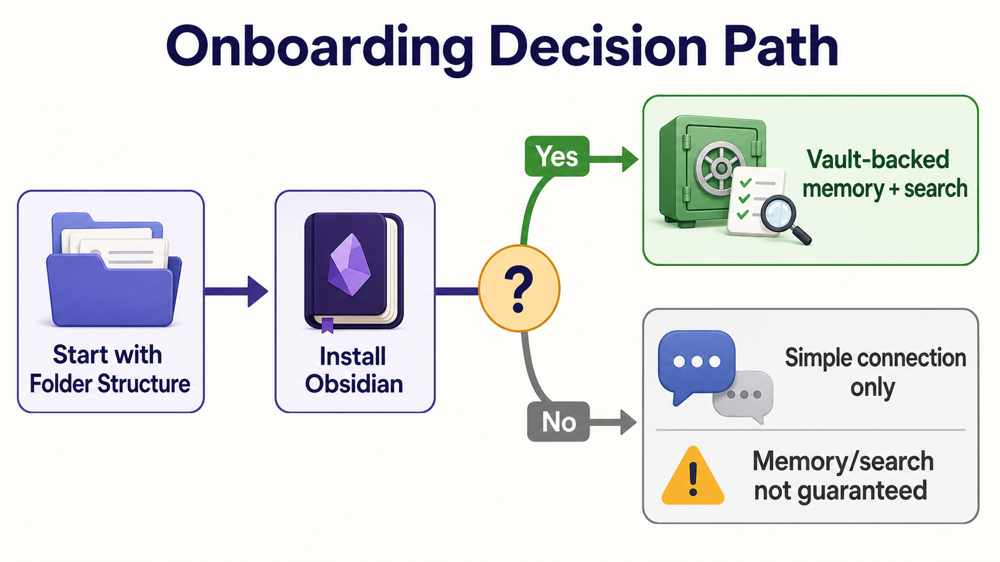
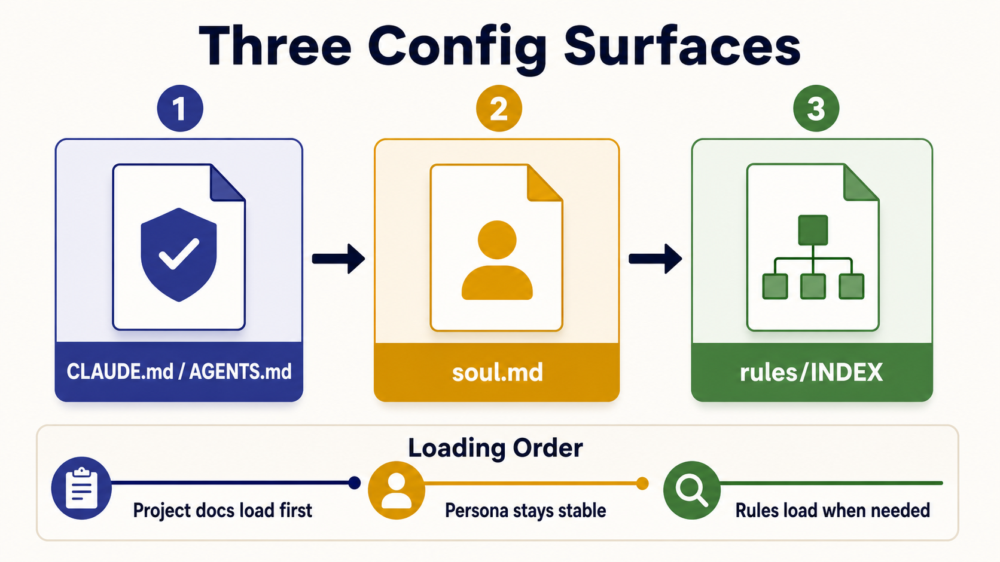

# Setup → Config Guide — wiring your Codex bot's brain

> After the [README](../README.md) §Setup installs ThisCodex, **this guide
> configures the bot's behavior**: the config surfaces a Codex bot reads, in
> what order, and how to author each one. It is a *hub* — it links to the
> canonical specs/templates instead of repeating them (same progressive-
> disclosure idea — 필요할 때만 펼치는 점진적 노출 — the rules system uses).
>
> Hard English terms glossed on first use. 🇰🇷 Korean mirror at `## 한국어`.

## In one minute (plain words)

New here and not a developer? Think of your bot as a **new teammate**:

- **CLAUDE.md / AGENTS.md / GEMINI.md** = their *one-page job sheet* — what the project is, where they sit, and "check the handbook when the situation calls for it." Keep it short.
- **soul.md** = their *personality & voice* — copy a ready-made template, fill the blanks.
- **rules/** = the *company handbook* — they do NOT memorize it; they open the one page that matches the moment.

You do three things: (1) put one job sheet, (2) pick a personality template, (3) point at the handbook. That is the whole setup. Everything below is just the detail of those three.

> **Don't want to hand-write any of it?** Run **§0 guided onboarding** — the
> installing AI designates your workspace, makes the skill plugin available,
> scans the workspace, and drafts the files *for* you via an interview. §1-§6
> then become reference, not homework.

## §0 — Guided onboarding (first run — recommended)



The non-developer path. The installing AI runs it **once**, and the output is
a finished `AGENTS.md` + `soul.md` per bot — produced by the bundled `/prompt`
skill and a short `/using-superpowers` interview, not hand-written. §1-§6
below are the manual equivalent if you'd rather author by hand or audit what
the AI produced.

### Prerequisites (do these first, in order)

**0a. Designate the workspace.** The installing AI asks you, in plain words:

- *"Which folder is your Obsidian vault / overall workspace?"* — the root the
  bots search and store into (**working directory** = 작업 폴더, the folder a
  bot "lives in").
- *"For each bot, what is its working directory?"* — one bot = one working
  directory; that folder is where that bot's `AGENTS.md` + `soul.md` go.

Don't guess the vault root — ask. (The companion
[ThisCode](https://github.com/treylom/ThisCode) repo ships
`scripts/claude-discode-init.sh --detect-only`, which autodiscovers a likely
vault path + note count; if it's available, use it to pre-fill candidates and
let the user confirm/correct.) A wrong vault root mis-scopes every later step,
so this is asked **before** anything is scanned or written.

**0b. Make superpowers available** (so the `/prompt` and `/using-superpowers`
skills the next steps need are loadable — **plugin** = 플러그인, an add-on
bundle of skills). Codex installs superpowers via its **own upstream Codex
path**, not the Claude Code plugin manager — see
[skill-portability.md](skill-portability.md) §2.5. The bundled `skills/prompt/`
itself ships **inside this repo** (already vendored), so `/prompt` needs no
extra step; superpowers adds `/using-superpowers` (the interview driver).
Verify the skill resolves with `/skills` (or a description-match invoke).

### The guided flow (the installing AI executes this)

1. **Scan the designated workspace.** For the vault root and each bot working
   directory, the AI reads: folder structure (top ~2 levels), any existing
   `AGENTS.md`/`CLAUDE.md`/`soul.md`, a *sample* of notes for dominant topics
   (it does not slurp the whole vault), and which Discord channel/role each
   bot will own. This grounds the draft in your *actual* workspace, not a
   generic template.
2. **Auto-invoke `/prompt` to draft the two meta files.** For each bot working
   directory, the AI **must** invoke the bundled `skills/prompt/` skill
   (force-invoke — see §6; never hand-roll) to produce: a thin `AGENTS.md`
   (the job sheet — §1 shape) and a `soul.md` seeded from the closest
   companion `ThisCode/templates/soul-*.md` (the persona — §2 shape).
   `/prompt` is mandatory here precisely because these two files *are* prompts
   (the bot's standing instruction); ad-hoc authoring is the exact regression
   §6 exists to stop. Also **scaffold the bot's `rules/`** by copying the
   bundled `rules/` skeleton (INDEX router + generic topical stubs) into the
   bot WD — `AGENTS.md` points only at `rules/INDEX.md` (§3); the stubs get
   filled in the next step, not inlined.
3. **Run the `/using-superpowers` advancement interview.** The AI invokes
   `/using-superpowers`, which routes to the brainstorming skill to interview
   you and refine the drafts — **one decision at a time**, not a wall of
   questions: this bot's role/scope (owns vs. delegates) · persona & voice
   (template, signature, forced self-check lines) · model id (a real Codex
   `gpt-5.x` id your CLI exposes — not invented) · Discord surface
   (channel/thread, mention id, meeting-thread governance) · vault scope
   (search/write paths; Obsidian-present vs. Obsidian-less). Answers are
   written back into the drafts; the meta file is then pointed at
   `rules/INDEX.md` (rules are never inlined — §3).
4. **Verify before declaring done.** `soul.md` frontmatter valid · signature
   line present · meta file points *only* at `rules/INDEX.md` · `/prompt` was
   actually entered (not free-handed) · the bridge actually injected the
   persona (SKILL.md §Verify). Then continue with the normal §4 flow.

**Obsidian-less path:** if at 0a you opt out of Obsidian, steps 0b-3 still
run, but vault scope is marked *connectivity-only* and the AI tells you
memory / internal-search quality is **not guaranteed** (mirrors the README
"Before you start").

### Force-invoke wiring (so a bot actually runs §0 on first setup)

So this is not skippable, wire it the same way §6 wires `/prompt`:

- In `AGENTS.md` (Codex's always-loaded meta), under the rules pointer, one
  line: *"First run / unconfigured working dir → MUST run SETUP-CONFIG-GUIDE
  §0 guided onboarding (designate workspace → make superpowers available →
  scan → `/prompt` draft → `/using-superpowers` interview) before normal
  work."*
- Or a `rules/INDEX.md` row:
  `First run / WD has no soul.md | onboarding.md | Run SETUP-CONFIG-GUIDE §0: workspace → superpowers → scan → /prompt → /using-superpowers`

## The config surfaces (and load order)



A ThisCodex (Codex CLI) bot composes behavior from these, in order:

```
1. AGENTS.md            ← project + bot working-dir meta. Codex auto-loads this
   (Codex's CLAUDE.md-     as the project doc. Points ONLY at rules/INDEX.md.
    equivalent)
        ↓
2. soul.md / SOUL.md    ← persona / voice / model meta. The bridge injects it
   (persona doc)           at session start (mirrors Claude's SessionStart).
        ↓
3. rules/INDEX.md       ← progressive disclosure. Bridge injects per-turn
   (router; on demand)     dynamic state; static rules stay here, pulled by
                            trigger — never re-injected every turn.
        ↓
   memory / meetings    ← run-time state, not config
```

**single source of truth** (단일 기준 출처 — one place each fact lives): keep
each surface to its own concern. Do not copy rules into `AGENTS.md`/`soul.md`
— that is the context-bloat failure the rules system exists to prevent.

| Surface | What it owns | Author from |
|---|---|---|
| `AGENTS.md` | project meta + bot-WD meta + INDEX pointer | §1 |
| `soul.md` | persona, voice, signatures, model | §2 |
| `rules/` | situational operating rules | §3 → [rules-system.md](rules-system.md) |

See also [skill-portability.md](skill-portability.md) §3 for *why* Codex uses
`AGENTS.md` and how the bridge injection differs from Claude Code.

## §1 — AGENTS.md (the meta file, Codex side)

Codex auto-loads `AGENTS.md` as the project document — it is the Codex
equivalent of Claude Code's `CLAUDE.md`. Keep it thin (it is always in
context). It carries: project, the bot's working-dir role, the **load order
above**, and a single pointer to `rules/INDEX.md` — never the rule bodies.

Minimal template:

```markdown
# <Project> — bot working-dir meta (Codex)

This dir is the project root and **<BotName>'s working dir**. On a bot
session, load in order:

0. ./AGENTS.md (this file — project + bot-WD meta; Codex auto-loads)
1. <path>/soul.md (persona · voice · model)
2. rules/INDEX.md (situational rules — Read the matched topic file on demand)
3. meetings/<date>-<topic>/ (current task context)

**Bot meta**: <BotName> (`<@discord-id>`) · <one-line role> · model `<id>` ·
WD `<abs-path>`.

## Operating rules = rules/ (progressive disclosure)
Every turn: self-check rules/INDEX.md trigger table → Read the matched row's
file → apply. Conflict priority: **explicit user instruction > rule file >
inline default**.
```

Gotcha: the pointer block must be the *only* rules content here. A rule that
grows inline moves to `rules/<topic>.md`, leaving one INDEX row.

## §2 — soul.md (persona / voice / model)

ThisCodex ships no template of its own — reuse the companion repo's fillable
soul templates (anatomy is harness-agnostic):

| Template | For |
|---|---|
| [soul-custom.md](https://github.com/treylom/ThisCode/blob/main/templates/soul-custom.md) | blank anatomy (11 sections) |
| [soul-general-assistant.md](https://github.com/treylom/ThisCode/blob/main/templates/soul-general-assistant.md) | general helper |
| [soul-research-bot.md](https://github.com/treylom/ThisCode/blob/main/templates/soul-research-bot.md) | research / source-tracing |
| [soul-writing-bot.md](https://github.com/treylom/ThisCode/blob/main/templates/soul-writing-bot.md) | writing persona |
| [soul-schedule-bot.md](https://github.com/treylom/ThisCode/blob/main/templates/soul-schedule-bot.md) | scheduling |

Steps:
1. Copy the closest template into your bot's working dir as `soul.md`.
2. Fill the **frontmatter** (문서 맨 위 `---` 메타 블록 — `name`,
   `description`, `version`, `triggers`). The bridge reads this to inject.
3. Keep the **forced-persona self-check table** + **completion signature**
   (`— <BotName>`) — signature absence is the #1 persona-regression symptom.
4. Set the model meta to a real Codex model id (e.g. a `gpt-5.x` id your
   Codex CLI exposes).

## §3 — rules/ (progressive-disclosure operating rules)

Full convention (problem, pattern, how-to-add, **Codex variant**):
**[rules-system.md](rules-system.md)** — canonical, in this repo. Read it
once; do not duplicate it here.

회의 스레드·채널·대화기록 보관 거버넌스: companion [ThisCode/docs/05-meeting-thread-protocol.md](https://github.com/treylom/ThisCode/blob/main/docs/05-meeting-thread-protocol.md) (정책 SoT = vault rules/channel-governance.md). Its "Applying to a Codex bot" section is the
authoritative spec for the `AGENTS.md` → `rules/` wiring.


Minimal worked example —

`rules/INDEX.md` (router; the only file `AGENTS.md` points at):
```markdown
| Trigger (when this situation) | Rule file | One-line gist |
|---|---|---|
| Replying to an external channel | discord-comms.md | Use the reply tool; terminal text never reaches the user |
```
`rules/discord-comms.md` (loaded only when that row matches):
```markdown
# Rule: external-channel reply
- The user reads the channel, not your terminal transcript. Send via the
  channel reply tool. Terminal-only output = user never sees it.
```

## §3.5 — Runtime ops tools (memory archival + meeting watchdog)

Two stdlib-only tools ship in `scripts/`. **Invocation contract** (the `+x`
bit is convenience, never load-bearing):
- **Manual run from the repo root** — relative is fine:
  `python3 scripts/<tool>.py …`
- **launchd / hook / any scheduler** — the working directory is NOT
  guaranteed, so you **MUST** use the absolute path:
  `python3 /absolute/path/to/<repo>/scripts/<tool>.py …`
  (e.g. launchd plist `ProgramArguments` =
  `["python3", "<repo>/scripts/memory_dreaming.py", "--scan"]`,
  `["python3", "<repo>/scripts/meeting_watchdog.py", "check", "<thread_id>"]`).
  A relative `scripts/...` in a scheduler is a recurrence trap — do not.

The relative `python3 scripts/<tool>.py` examples below are **manual,
repo-root** form; for any unattended/scheduled caller substitute the
absolute path above.

**memory-dreaming** — reversible memory archival (*move, never delete*).
Plain intro: [memory-dreaming.md](memory-dreaming.md).
- `python3 scripts/memory_dreaming.py --scan` = default dry-run report (no
  changes). `--apply` is gated (corpus-baseline precondition fail-closed +
  dry-run cycle counter). `--restore <slug>` = checksum-verified undo.
  `--recalibrate` = Phase0 corpus measurement.
- Weekly-enforced via three layers: a YAML manifest
  (`~/.claude-memory-archive/dreaming-schedule.yaml`) + a session-start
  overdue check + a launchd weekly job; any one down, the others hold the
  cadence. Fresh install sets `next_due = install + 7d` (not instantly
  overdue).
- Safe defaults: nothing auto-archives unless high-confidence (per-run
  capped); ambiguous → human review; behavioral (`user`/`feedback`) memory
  is an unconditional keep; voice/persona memory is never auto-banded.
- Codex memory tier (`~/.codex/memories`) is picked up automatically; the
  cold subdir is `MEMORY_DREAMING_CODEX_SUB` (shipped default `codex`).

**meeting-watchdog** — enforce progress on a created meeting thread.
- `python3 scripts/meeting_watchdog.py start <thread_id> --goal <…>
  --tasks-total N`, then a launchd ~5-min `check <thread_id>`, plus
  `beat <thread_id> --tasks-done M --goal-met true|false` pushed by the
  orchestrator (only it can read `/goal` + task state). Also `status` /
  `stop`.
- Terminates ONLY when the goal is met AND all tasks complete. Fail-closed
  = keep-active: a corrupt/absent manifest never terminates a live meeting.
Discord post is best-effort; `MEETING_WATCHDOG_SIGNATURE` (default empty)
optionally appends a persona signature.

### ThisCodex installer

Prefer the Node entry over shell scripts:

```bash
node bin/thiscodex.mjs --check
node bin/thiscodex.mjs --apply
```

The installer uses `~/.agents/skills/thiscodex` by default because Codex scans
that user-tier skill layer. Repo-local `.agents/skills/thiscodex` is available
for project-scoped installs. `.codex-plugin` is a marketplace/helper path, not
the primary loose-install path.

#### Installer ownership

The Node installer is the single owner of Codex skill placement. It copies
`skills/thiscodex` into the selected Codex-visible layer (`~/.agents/skills`
by default, repo-local `.agents/skills` when selected). ThisCodex intentionally
does not ship a second shell sync script; duplicate sync paths drift and are
harder to run on Windows.

`scripts/launch.sh` remains a legacy/tmux fallback for operators who already
run a bridge manually. New users should follow the Node runner guide. When
`launch.sh` is used, set `THISCODEX_SHELL=${SHELL:-/bin/sh}` (or an explicit
shell path) so the script does not require zsh.

When a user explicitly chooses YOLO/full-access mode, warn that the bridge's
per-turn `sandbox:"danger-full-access"` and `approvalPolicy:"never"` can still
be clamped by Codex app-server defaults unless `~/.codex/config.toml` also has
`sandbox_mode = "danger-full-access"` and `approval_policy = "never"`. The
installer may add those two keys only in the Q6e YOLO opt-in path, after
showing the security warning and backing up the file. Safe mode remains the
zero-config default.

## §4 — How to set up & how to ask (first run)


Install per [README §Setup](../README.md) and [SKILL.md](../skills/thiscodex/SKILL.md)
(register: `codex plugin marketplace add treylom/ThisCodex`; invoke via
`/skills thiscodex` or description match — there is no `codex plugin install`
subcommand).

Example asks and what to expect:

| You ask | The bot does |
|---|---|
| "Set up codex as a discord bot like claude code" | walks the bridge + persona + rules wiring (this guide) |
| "Port these Claude Code skills/rules to Codex" | applies the [skill-portability.md](skill-portability.md) path |
| "Why did you do X?" | answers from the injected soul + the rule that applied (it names which) |

Off-persona / rule ignored? Check (a) `soul.md` frontmatter valid, (b) the
situation matches an `rules/INDEX.md` trigger row, (c) the bridge actually
injected the persona (see SKILL.md §Verify / §Troubleshooting).

## §5 — Skills 2.0 conformance checklist

Any skill under `skills/<name>/SKILL.md` should pass:

- [ ] **Frontmatter present** — `---` block with `name` + `description`
- [ ] `name:` **kebab-case**, matches the directory
- [ ] `description:` **third-person** + a **"Use when …"** trigger phrase
- [ ] **SKILL.md ≤ 500 lines** — heavy detail → `references/` (progressive
      disclosure: load depth on demand)
- [ ] **No orphan dirs** — every skill dir has a `SKILL.md`
- [ ] **No broken references** — every `references/` link resolves
- [ ] **Imperative form** — "Run", "Check" (not "you should …")
- [ ] **Reference-type skills** set `disable-model-invocation: true`

This checklist **is** the conformance standard (Anthropic Skills 2.0 — the
12-check rubric: frontmatter, name, description, ≤500 lines, directory
structure, invocation control, no orphans/broken refs, progressive disclosure,
imperative form). Walk every box manually, and grep the diff for hardcoded
user paths / secrets, before any push.

## §6 — Force-invoke the `/prompt` skill

The bundled `skills/prompt/` skill must be **mandatorily invoked** for any
prompt-authoring work (writing/refining a prompt, GPTs/Gems instructions,
fact-check/research/image prompting) — never free-hand a prompt.

Wire enforcement into the Codex bot's config:

- In `AGENTS.md` (Codex's always-loaded meta), add one line under the rules
  pointer: *"Prompt-authoring tasks → MUST invoke the `prompt` skill before
  producing any prompt (no ad-hoc prompts)."*
- Or a `rules/INDEX.md` row: `Producing a prompt for a model | prompt-skill.md | Invoke skills/prompt first; never hand-roll`.
- In `soul.md`, put a hard rule in the forced-persona self-check table (reuse
  the companion `ThisCode/templates/soul-custom.md`, which includes a `/prompt`
  enforcement line).

Why a hard rule: prompt quality regresses to ad-hoc without enforced routing;
the skill's frameworks (IFCN fact-check base, 5-stage image, GPTs/Gems
structure) apply only if the skill is actually entered.

## Stuck? — friendly FAQ

**Q. The bot ignores its personality / signature.**
A. Open `soul.md`. Is the top `---` block (frontmatter) filled and valid? Is the completion-signature line still there? Missing signature is the #1 cause.

**Q. The bot did not follow a rule I expected.**
A. A rule only loads when its trigger row in `rules/INDEX.md` matches the situation. Check that a row actually describes your case; if not, add one.

**Q. Where do I put these files?**
A. The job sheet (`CLAUDE.md`/`AGENTS.md`) at the project/bot root; `soul.md` in the bot working dir; `rules/` next to it. The load order at the top of this guide shows the sequence.

**Q. Do I really need Obsidian?**
A. For full memory + internal search, yes — recommended. Without it a plain Discord bot still works for basic connectivity, but memory/search quality is not guaranteed (see the README "Before you start").

**Q. What model id do I write in soul.md?**
A. A real id your tool exposes (e.g. an Opus/Sonnet/Haiku id for Claude Code, a gpt-5.x id for Codex). Not a made-up name.

**Q. It still feels overwhelming.**
A. Do only the three steps in "In one minute" first. Skip §1-§6 detail until something breaks; this guide is a reference, not a checklist to finish in one sitting.

## See also

- [README.md](../README.md) / [README.ko.md](../README.ko.md) — overview + install
- [skill-portability.md](skill-portability.md) — CC ↔ Codex porting (why AGENTS.md)
- [ThisCode](https://github.com/treylom/ThisCode) — the Claude Code companion runtime

---

## 한국어

[README](../README.md) 설치 **후** Codex 봇 행동을 설정하는 가이드. 봇이 읽는
설정 표면과 **로딩 순서**, 작성법을 묶고, 깊은 내용은 정본 문서로 링크(필요할
때만 펼치는 progressive disclosure — 점진적 노출). 어려운 영어는 첫 등장에 풀이.

### §0 가이드 온보딩 (첫 실행 — 권장, 비개발자용 경로)

직접 안 쓰고 싶으면 이 경로. 설치 AI 가 **한 번** 실행, 결과물은 봇별 완성된
`AGENTS.md` + `soul.md` — 번들 `/prompt` 스킬 + 짧은 `/using-superpowers`
인터뷰가 생성(손으로 안 씀). 아래 §1~§6 은 손수 작성/감수 시의 수동 대응판.

**선행(이 순서로 먼저):**

- **0a. 작업공간 지정.** 설치 AI 가 평이하게: ① "옵시디언 볼트 / 전체 작업
  폴더 어디예요?"(봇 검색·저장 루트 — **working directory** = 작업 폴더) ②
  "봇마다 작업 폴더 어디예요?"(봇 1개=폴더 1개, 그 폴더에 그 봇
  `AGENTS.md`+`soul.md`). 볼트 루트 추측 ❌ — 물어볼 것. 동반
  [ThisCode](https://github.com/treylom/ThisCode) 레포의
  `scripts/claude-discode-init.sh --detect-only` 가 볼트 후보·노트 수
  자동탐지 — 가용 시 후보 채워 사용자 확인/수정. 루트 틀리면 이후 전 단계
  어긋남 → **스캔·작성 전에** 먼저.
- **0b. superpowers 가용화**(`/prompt`·`/using-superpowers` 로드용 —
  **plugin** = 플러그인, 스킬 묶음 애드온). Codex 는 Claude Code 플러그인
  매니저가 아니라 **자체 upstream Codex 경로**로 superpowers 설치 —
  [skill-portability.md](skill-portability.md) §2.5. 번들 `skills/prompt/` 는
  **본 레포 안에 동봉**(이미 vendored)이라 `/prompt` 추가 단계 불필요,
  superpowers 가 인터뷰 구동용 `/using-superpowers` 추가. `/skills`(또는
  description 매칭)로 스킬 해석 확인.

**가이드 흐름(설치 AI 실행):**

1. **지정 작업공간 스캔** — 볼트 루트+각 봇 작업폴더의 폴더 구조(상위 ~2
   레벨)·기존 `AGENTS.md`/`CLAUDE.md`/`soul.md`·노트 *샘플*(전체 흡입 ❌)
   주제·담당 Discord 채널/역할. 일반 템플릿 아닌 *실제* 작업공간 근거.
2. **`/prompt` 자동 호출로 메타 2파일 초안** — 봇 작업폴더마다 번들
   `skills/prompt/` **반드시** 호출(force-invoke, §6 — 손작성 금지)해 얇은
   `AGENTS.md`(업무지시서 §1) + 가장 가까운 동반
   `ThisCode/templates/soul-*.md` 기반 `soul.md`(페르소나 §2). 이 두 파일이
   곧 prompt(봇 상시 지시) → `/prompt` 강제, 즉흥 작성이 §6 이 막는 회귀.
   동시에 **봇 `rules/` 스캐폴드**: 번들 `rules/` 스켈레톤(INDEX 라우터 +
   generic topical 스텁)을 봇 WD 로 복사 — `AGENTS.md` 는 `rules/INDEX.md`
   만 가리킴(§3), 스텁은 다음 단계에서 채움(inline ❌).
3. **`/using-superpowers` 고도화 인터뷰** — 호출 → brainstorming 라우팅 →
   **한 번에 한 결정씩**(질문 폭탄 ❌): 역할/범위(직접 vs 위임) ·
   페르소나·말투(템플릿·서명·자가점검 줄) · 모델 id(CLI 가 실제 노출하는
   Codex `gpt-5.x` id, 지어냄 ❌) · Discord 표면(채널/스레드·mention id·회의
   스레드 거버넌스) · 볼트 범위(옵시디언 유/무). 답을 초안 반영 후 메타를
   `rules/INDEX.md` 포인팅(규칙 inline ❌ — §3).
4. **완료 선언 전 검증** — soul.md frontmatter 유효 · 서명 줄 · 메타가
   `rules/INDEX.md` *만* 가리킴 · `/prompt` 실제 진입 · bridge 페르소나 주입
   (SKILL.md §Verify). 이후 §4 흐름.

**옵시디언 없는 경로:** 0a 미사용 선택 시 0b~3 그대로, 볼트 범위=연결 전용
표시 + 메모리/내부검색 품질 미보장 안내(README "Before you start" 동일).

**강제 호출 배선(첫 셋업에 §0 실제 실행):** §6 가 `/prompt` 배선과 동일 —
`AGENTS.md` 규칙 포인터 아래 한 줄: *"첫 실행 / 미설정 작업폴더 → 일반 작업
전 SETUP-CONFIG-GUIDE §0(작업공간 지정 → superpowers 가용화 → 스캔 →
`/prompt` 초안 → `/using-superpowers` 인터뷰) 필수."* 또는 `rules/INDEX.md`
행: `첫 실행 / WD 에 soul.md 없음 | onboarding.md | SETUP-CONFIG-GUIDE §0 실행: 작업공간→superpowers→스캔→/prompt→/using-superpowers`

### 설정 표면 + 로딩 순서
`AGENTS.md`(프로젝트+봇 WD 메타 — Codex 가 프로젝트 문서로 자동 로드, Claude 의
CLAUDE.md 대응, **rules/INDEX.md 만 가리킴**) → `soul.md`(페르소나·말투·모델,
bridge 가 세션 시작 시 주입) → `rules/INDEX.md`(라우터; bridge 는 매 턴 동적
상태만 주입, 정적 규칙은 트리거로 pull — 매 턴 재주입 안 함) → 메모리/회의록.
**single source of truth(단일 기준 출처)**: 규칙을 AGENTS.md/soul.md 에 복붙
금지 — context 비대화 방지가 rules 시스템의 존재 이유.

### §1 AGENTS.md (Codex 메타)
항상 context — 얇게. (a)프로젝트 (b)봇 WD 역할 (c)위 로딩 순서 (d)
`rules/INDEX.md` 포인터 1개. 템플릿은 위 영문 §1 코드블록.

### §2 soul.md
ThisCodex 자체 템플릿 없음 → 동반 레포 ThisCode 의 `templates/soul-*.md`(절대
링크, 위 표) 중 가까운 것 복사 → frontmatter(맨 위 `---` 메타 블록) 채움 →
자가점검 표 + 완료 서명(`— <봇이름>`) 유지 → 모델 메타를 Codex CLI 가 실제
노출하는 `gpt-5.x` id 로.

### §3 rules/
정본 = [rules-system.md](rules-system.md)(본 레포, 중복 금지). "Applying to a
Codex bot" 절이 AGENTS.md→rules/ 배선 정본. 매 턴 INDEX 스캔 → 매칭 파일 그때
Read → 적용. 우선순위 = **사용자 명시 지시 > rule 파일 > inline 기본**.

### §4 설정·질문 방법
[README §Setup](../README.md) + [SKILL.md](../skills/thiscodex/SKILL.md) 대로
설치(`codex plugin marketplace add treylom/ThisCodex`, `/skills thiscodex` 로
호출 — `codex plugin install` 서브커맨드 없음). 페르소나/규칙 벗어나면 soul.md
frontmatter·INDEX 매칭·bridge 주입(SKILL.md §Verify/§Troubleshooting) 점검.

### §5 Skills 2.0 체크리스트
`skills/<name>/SKILL.md`: frontmatter 존재 · `name` kebab-case ·
`description` 3인칭 + "Use when …" · ≤500줄(초과분 `references/`) · orphan
디렉토리 없음 · 깨진 reference 없음 · 명령형 · reference형은
`disable-model-invocation: true`. **본 체크리스트가 곧 표준**(Anthropic
Skills 2.0 12-check 루브릭). push 전 매 항목 수동 확인 + diff 에서 하드코딩
경로·시크릿 grep 검사 필수.

### 1분 설명 (비개발자용)

봇을 **새 팀원**이라고 생각하세요:
- `CLAUDE.md/AGENTS.md/GEMINI.md` = 한 장짜리 **업무 지시서**(프로젝트가 뭔지·어디 앉는지·"상황 맞으면 매뉴얼 펴봐"). 짧게.
- `soul.md` = **성격·말투**. 완성 템플릿 복사 후 빈칸 채우기.
- `rules/` = **사내 매뉴얼**. 통째로 외우지 않고, 그 순간에 맞는 한 페이지만 펴봄.

할 일 3개: ① 지시서 1장 ② 성격 템플릿 1개 ③ 매뉴얼 가리키기. 이게 전부입니다. 아래는 그 3개의 세부일 뿐.

### 막히면? — 자주 묻는 질문

- **봇이 성격/서명을 무시해요** → `soul.md` 맨 위 `---` 블록 채워졌는지 + 완료 서명 줄 남아있는지 (서명 누락이 1순위 원인).
- **기대한 규칙을 안 따라요** → 규칙은 `rules/INDEX.md` 트리거 행이 상황과 맞을 때만 로드. 내 상황 설명하는 행 있는지 확인, 없으면 추가.
- **파일 어디 둬요?** → 지시서=프로젝트/봇 루트, `soul.md`=봇 작업폴더, `rules/`=그 옆. 맨 위 로딩 순서 그림 참고.
- **옵시디언 꼭 필요해요?** → 메모리·내부검색 제대로 쓰려면 권장. 없이도 단순 연결은 되지만 품질 미보장.
- **모델 id 뭘 써요?** → 도구가 실제 노출하는 id(Claude=Opus/Sonnet/Haiku id, Codex=gpt-5.x id). 지어낸 이름 ❌.
- **너무 복잡해요** → 위 "1분 설명" 3단계만 먼저. 뭔가 깨지기 전엔 §1~§6 세부 skip. 이 문서는 한 번에 끝낼 체크리스트가 아니라 참조용.
